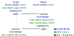

# uOSCORE / uEDHOC 

This repository contains C implementations  for constrained (and non-constrained) devices of the IETF protocols:

* [OSCORE (RFC8613)](https://tools.ietf.org/html/rfc8613) and
* [EDHOC (draft-ietf-lake-edhoc-02 )](https://tools.ietf.org/html/draft-ietf-lake-edhoc-02). 

Main features of uOSCORE and uEDHOC are their independence from the OS, cryptographic engine and in the case of uEDHOC transport protocol. Additionally,  uOSCORE and uEDHOC use only stack memory (no heap). uOSCORE and uEDHOC are available as pre-compiled static libraries for several popular architectures such as x86 and Cortex M.

For more background and evaluation in terms of speed, RAM and flash requirements see our paper [The Cost of OSCORE and EDHOC for Constrained Devices](https://arxiv.org/pdf/2103.13832.pdf).


## Project (Folder) Structure

```
.
|---externals/
| |---blerouter/
| |---cantcoap/
| |---compact25519/
| |---tinycbor/
| |---tinycrypt/
|---modules/
| |---oscore/
| |---edhoc/
|---samples/
|---test/
  |---packaged
```

* The folder `externals` contains the external libraries and tools as git submodules.
* The folder `modules` contains the core implementations -- OSCORE and EDHOC.
* The folder `samples` contains some usage examples.
* The folder `test` contains automated tests. 
* The  folder `test/packaged` contains tested uOSCORE and UEDHOC static libraries for some common architectures.

## API and Usage Model

#### uOSCORE

The API of uOSCORE consists of three functions: 
* `oscore_context_init()`,
*  `coap2oscore()` and 
*  `oscore2coap()`.

`coap2oscore()` and `oscore2coap()` convert CoAP to OSCORE packets and vice versa. `oscore_context_init()` initializes the OSCORE security context. 

First, `oscore_context_init()` function needs to be called on the client and server side, then `coap2oscore()` and `oscore2coap()`  are called just before sending or receiving packets over the network.




#### uEDHOC

The API of uEDHOC consists of three functions:
*  `ephemeral_dh_key_gen()`
* `edhoc_initiator_run()`,
* `edhoc_responder_run()`,
* `edhoc_exporter()`,

`ephemeral_dh_key_gen()` is used to generate fresh ephemeral DH keys before running the protocol. This function requires a random seed suable for cryptographic purposes. `edhoc_initiator_run()` and `edhoc_responder_run() ` has to be called on the initiator and responder side respectively. They return the exchanged auxiliary data `AD_x`,  the derived shared secret `PRK_4x3m` and the transcript hash `TH_4`.   `PRK_4x3m` and `TH_4` are used as inputs for `edhoc_exporter()` to derive application specific keys, e.g., OSCORE master secret and OSCORE master salt.

The EDHOC protocol requires the exchange of three messages which is independent from the underlying message transport protocol. For example [Section 7 in the EDHOC specification](https://tools.ietf.org/html/draft-ietf-lake-edhoc-03#section-7) describes how  EDHOC can be transfered over CoAP, however CoAP is not mandatory. In order to be independent from the transport protocol uEDHOC uses two functions which need to be implemented by the user for handling the sending and receiving of messages. These functions are:

```c
/**
 * @brief   The user should call inside this function its send function. 
 * @param   data pointer to the data to be send
 * @param   data_len length of the data
 */
extern EdhocError tx(uint8_t *data, uint32_t data_len);

/**
 * @brief   The user should call inside this function its receive function.  
 *          The length of the buffer pointed by data can be checked before 
 *          copying data into it by using *data_len. After copying the length 
 *          of the received data should be written in data_len.
 * @param   data pointer to a buffer where the edhoc message must be copied in
 * @param   data_len length of the received data
 */
extern EdhocError rx(uint8_t *data, uint32_t *data_len);
```


## Supported Cipher Suites

| uOSCORE                                              |
| ---------------------------------------------------- |
| AES-CCM-16-64-128,  SHA-256 (mandatory to implement) |


| uEDHOC                                                       |
| ------------------------------------------------------------ |
| AES-CCM-16-64-128, SHA-256, X25519, EdDSA, Ed25519, AES-CCM-16-64-128, SHA-256 (mandatory to implement, suite 0) |


## External Libraries

Several external libraries are used as git submodules

| Name         | exchangeable | used in        | License                                                      | Version                                  |
| ------------ | ------------ | -------------- | ------------------------------------------------------------ | ---------------------------------------- |
| tinycbor     | No           | uOSCORE/uEDHOC | [MIT](https://github.com/zephyrproject-rtos/tinycbor/blob/zephyr/LICENSE) | 31ae89e4b768612722620cb6cb173a0de4a19cc9 |
| tinycrypt    | Yes          | uOSCORE/uEDHOC | [custom](https://github.com/intel/tinycrypt/blob/master/LICENSE) | 5969b0e0f572a15ed95dc272e57104faeb5eb6b0 |
| compact25519 | Yes          | uEDHOC         | [CC0 1.0](https://github.com/DavyLandman/compact25519/blob/master/LICENSE) | a5abe6fdf36a13237d674c848b6ccf73efcd5ad4 |
| cantcoap     | Yes          | Samples        | [BSD 2-Clause](https://github.com/staropram/cantcoap/blob/master/LICENSE) | cce97e570bfc918583ee7f2a3baf17ce9b754754 |

## Using the Samples

The samples contained in `samples/` are supposed to enable the test and verification of a real OSCORE or EDHOC message exchange between two entities. There are samples that can be run on microcontrollers, e.g. NRF5x (using ZephyrOS) and samples that can be run on Linux systems.

When using the samples for microcontroller , they have to be connected to an IPv6 network, which can be done with an IPv6 over BLE border router, using Bluetooth on the constrained devices. For further instructions on how to set up the border router on a Raspberry Pi, see [blerouter](externals/blerouter/README.MD).

* **OSCORE Between a Microcontroller (e.g. nrf52832) as a Server and Linux Host as a Client** 

  The `oscore_device` samples suggest a use of a microcontroller, (e.g. nrf52832) as an OSCORE server and a Linux machine as an OSCORE client. Therefore setting up the network as described in [blerouter](externals/blerouter/README.MD) is required.
  As this is a frequent error source: make sure that all addresses are set up correctly in the blerouter.sh script, the samples/oscore_linux/client/src/main.cpp file and the samples/oscore_device/server/prj.conf file.

  * Configure and build OSCORE server on a microcontroller (nrf52832) using the Zephyr's build tool west 

    * open a terminal and cd to samples/oscore/device/server 

    ```bash
    source <path to zephyr root>/zephyrproject/zephyr/zephyr-env.sh
    west build -b=nrf52dk_nrf52832
    west flash
    ```

    * The server is now reachable under the specified address and can be supplied with CoAP and OSCORE messages.

  * On a Raspberry Pi start externals/blerouter

    ```bash
    sudo ./blerouter.sh -d OscoreServer
    # if it works correctly you should see somthink like:
    # [18:27:47] scanning for devices
    # connect to D9:A4:16:41:CC:2D OscoreServer
    # [18:27:54] connected with D9:A4:16:41:CC:2D OscoreServer
    # [18:27:57] connected with D9:A4:16:41:CC:2D OscoreServer
    # ...
    ```

    

  * Configure OSCORE Linux client

    * open a terminal and cd to samples/oscore_linux/client

    * run ```make``` and ```./build/oscore_linux_client to send CoAP and OSCORE messages to the OSCORE server

* **OSCORE Between to Linux Hosts**

  Adjust the IP address of the other party in  samples/oscore_linux/client and samples/oscore_linux/server and run them.

* **EDHOC**

  Two parties are involved in a EDHOC message exchange -- an initiator (typically client) and a responder (typically server). The `edhoc_device` samples suggest the communication between a microcontroller and a Linux machine, with the network set up as described in [blerouter](externals/blerouter/README.MD). However, there can also be two Linux machines or two microcontrollers performing the EDHOC exchange, with the latter case requiring a second RPi set up as border router and connected to the second microcontroller. The addresses have to be changed accordingly in the prj.conf files. The following describes the setup for the EDHOC exchange between microcontroller and linux machine.

  * Microcontroller as initiator and Linux machine as responder

      * open a terminal and cd to samples/edhoc_linux/responder
      * make sure the IP addresses are correct
      * run ```make``` and ```./build/responder``` to build and run
      * the linux responder can now be supplied with an EDHOC requests
      * cd to samples/edhoc_device/initiator
      
      ```bash
      source <path to zephyr root>/zephyrproject/zephyr/zephyr-env.sh
      west build -b=nrf52dk_nrf52832
      west flash
      ```
      * set up the border router as described here [blerouter](externals/blerouter/README.MD)
      
      * the EDHOC message exchange should take place and the results should be printed on the linux machine - the message traffic can be captured and viewed using wireshark on the border router
      
  * Linux machine as initiator and Microcontroller as responder
    
    * open a terminal and cd to samples/edhoc_device/responder
    
    ```bash
    source <path to zephyr root>/zephyrproject/zephyr/zephyr-env.sh
    west build -b=nrf52dk_nrf52832
    west flash
    ```
    
    * set up the border router as described here [blerouter](externals/blerouter/README.MD)
    * the Microcontroller can now be supplied with an EDHOC request
    * cd to samples/edhoc_linux/initiator
    * run ```make``` and ```./build/initiator``` to build and run
    * the EDHOC message exchange should take place and the results should be printed on the linux machine - the message traffic can be captured and viewed using wireshark


## Using Different Cryptographic Libraries or Hardware Accelerators

The logic of uOSCORE and uEDHOC is independent form the cryptographic library, i.e., the cryptographic library can easily be exchanged by the user. For that the user needs to provide implementations for the functions specified in `crypto_wrapper.c`. 

## Using uOSCORE and uEDHOC as Static Libraries 

Self-contained, tested static libraries are available in the folder `test/packaged` .  They contain the protocol logic and the required subroutines from tinycrypt, tinycbor and compact25519. These libraries are build with optimization -O3. Currently supported are the following architectures:

* x86
* x86-64
* Cortex M0
* Cortex M3
* Cortex M4
* Cortex M33
